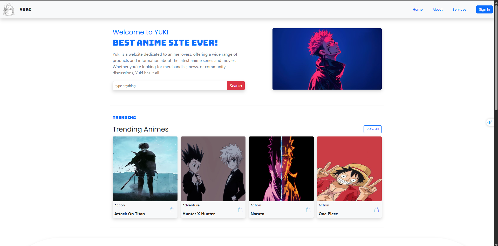
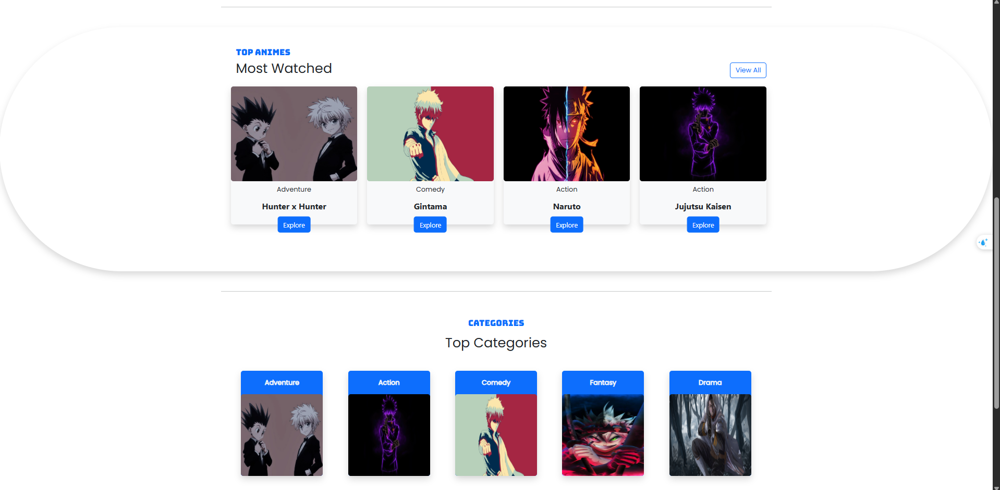
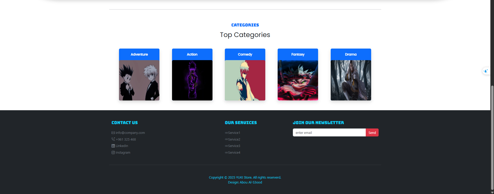

# 🎌 YUKI Anime Store

A responsive anime-themed landing page and storefront built with HTML, Bootstrap 5, and Google Fonts.

---

## 📋 Table of Contents
1. [About](#about)  
2. [Features](#features)  
3. [Demo / Screenshot](#demo--screenshot)  
4. [Built With](#built-with)  
5. [Getting Started](#getting-started)  
6. [Project Structure](#project-structure)  

---

## 🧾 About
YUKI is an anime store landing page showcasing trending and top anime, complete with search, categories, hero section, and newsletter signup—all fully responsive.

---

## 🌟 Features
- Mobile-first responsive layout with offcanvas menu  
- Hero section with search input  
- Sections: Trending, Most Watched, Categories  
- Footer with contact links and newsletter form  

---

## 📷 Demo / Screenshot






---

## 🛠️ Built With
- [Bootstrap 5.3](https://getbootstrap.com) – framework for responsive UI  
- Google Fonts – **Poppins**, **Bungee**  
- Bootstrap Icons  

---

## 🚀 Getting Started

### Prerequisites
Just a modern browser—no backend needed.

### Installation
1. Clone the repo:
   ```bash
   git clone [https://github.com/Aboals3ood/YUKI.git]

yuki-anime-store/
├── index.html
├── images/
│   ├── ani.png
│   ├── hero-images…
├── css/
│   └── styles.css    # Optional custom styles
├── js/
│   └── scripts.js    # Optional interactivity
└── README.md
